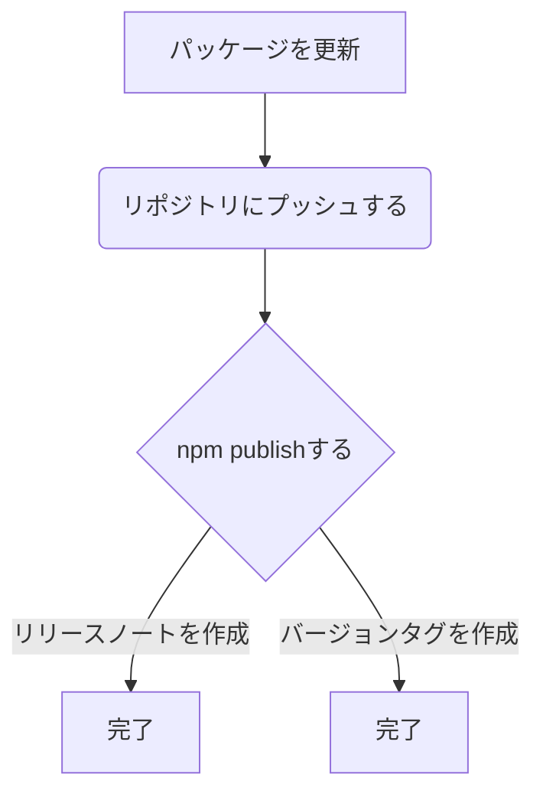

# 概要

こちらの続編です。
https://zenn.dev/naonao70/articles/17036b2a85e178


GitHub Actionsのworkflowsを利用してバージョン管理やリリースノートを自動的に作成する仕組みを作りました

## やり方

以下で作成したリポジトリで作業を行います
https://zenn.dev/naonao70/articles/17036b2a85e178

## 以下の手順を手動で行うのは手間なので自動化していきます



## workflowsを定義します

```yml:.github/workflows/main.yml

# 任意のworkflow名を入力します
name: GitHub Packages Publish

on:
  # pushすると自動的に動作する
  push:
  # 対象ブランチ
    branches:
      - master

jobs:
  setup:
    name: setup
    # Ubuntu最新版環境で実行する
    runs-on: ubuntu-latest

    # ジョブに依存しているすべての下流のジョブから利用する
    outputs:
      version: ${{ steps.package-version.outputs.version }}
      tag-name: v${{ steps.package-version.outputs.version }}
      is-pre-verion: ${{ steps.pre-version.outputs.pre-version }}
      tag-exist: ${{ steps.tag-exist.outputs.exists }}

    steps:
        # すべてのタグとブランチのすべての履歴を取得
      - name: checkout
        uses: actions/checkout@v2

      - name: setup Node
        uses: actions/setup-node@v2
        with:
          node-version: '14'
          registry-url: "https://npm.pkg.github.com"

      - name: set package version
        id: package-version
        # node -p 結果を出力 -e 渡した文字列をスクリプトとして実行
        # 出力パラメータの設定 '`::set-output name=version::${require("./package.json").version}`'
        run: node -p -e '`::set-output name=version::${require("./package.json").version}`'

      - name: check pre-release
        # 範囲指定有無の判定
        id: pre-version
        run: node -p -e '`::set-output name=pre-version::${require("./package.json").version.includes("-")}`'

        # タグが存在するかを判定
      - name: check tag exists
        uses: mukunku/tag-exists-action@v1.0.0
        id: check-tag
        with:
          tag: ${{ steps.package-version.outputs.version }}
        # 全てのstepsから参照できる
        env:
          # 最低限の権限で実行する
          GITHUB_TOKEN: ${{ secrets.GITHUB_TOKEN }}

  publish:
    name: publish
    # このジョブの実行前に正常に完了する必要があるジョブ
    needs: setup
    runs-on: ubuntu-latest
    steps:
      - name: checkout
        uses: actions/checkout@v2
      - name: setup Node
        uses: actions/setup-node@v2
        with:
          node-version: 14.x
          registry-url: "https://npm.pkg.github.com"

      # キャッシュ
      - name: Cache node modules
        uses: actions/cache@v2
        with:
          # npm キャッシュファイルは Linux/macOS の `~/.npm` に保存される
          path: ~/.npm
          key: ${{ runner.os }}-node-modules-${{ hashFiles('**/package-lock.json') }}
          restore-keys: |
            ${{ runner.os }}-node-modules-
            ${{ runner.os }}-node-
            ${{ runner.os }}-

      # npm publishする
      - name: publish
        # npx can-npm-publish --verbose npm publish可能かのチェックリスト
        # https://efcl.info/2018/06/21/can-npm-publish/
        run: |
          npx can-npm-publish --verbose && npm publish || echo "Does not publish"
        env:
          NODE_AUTH_TOKEN: ${{ secrets.GITHUB_TOKEN }}

      # タグを作成する
      - name: package-version-to-git-tag
        uses: pkgdeps/git-tag-action@v2
        with:
          # 以下は魔法の呪文的なお決まり
          github_token: ${{ secrets.GITHUB_TOKEN }}
          github_repo: ${{ github.repository }}
          version: ${{ needs.setup.outputs.version }}
          git_commit_sha: ${{ github.sha }}
          # タグ名
          git_tag_prefix: "v"

  release-note:
    name: release note
    needs: [setup, publish]
    runs-on: ubuntu-latest
    steps:
      - name: checkout
        uses: actions/checkout@v1
      - name: setup Node
        uses: actions/setup-node@v1
        with:
          node-version: 14.x
          registry-url: "https://npm.pkg.github.com"

      # リリースノートを自動作成
      - name: set change log
        uses: scottbrenner/generate-changelog-action@master
        id: change-log
      - name: Create a GitHub release
        uses: actions/create-release@v1
        if:  needs.setup.outputs.tag-exist != 'true' && needs.setup.outputs.is-pre-verion != 'true'
        env:
          GITHUB_TOKEN: ${{ secrets.GITHUB_TOKEN }}
        with:
          tag_name: ${{ needs.setup.outputs.tag-name }}
          release_name: Release ${{ needs.setup.outputs.tag-name }}
          body: ${{ steps.change-log.outputs.changelog }}
```

## package.jsonの"version"を1.0.1に更新します

```json:package.json

{
  "name": "@プロジェクト名/リポジトリ名",
  "version": "1.0.1",
  "repository": {
    "type": "git",
    // GitHubリポジトリをCronする際のHTTPS
    "url": "https://github.com/xxx/test.git",
    "directory": "GitHub-Packages-sample"
  }
}
```

## ここまでの処理内容をmainブランチにpushします

```bash:bash
git add .
git commit -m "feat:初めてのGitHubActions"
git push
```
